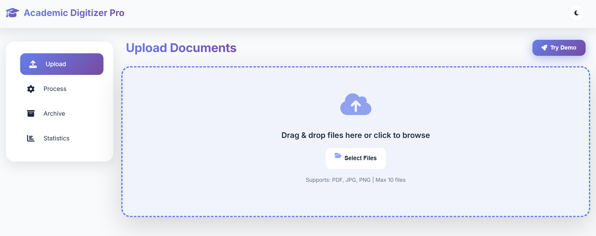
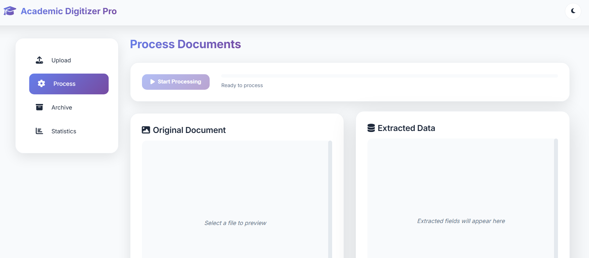
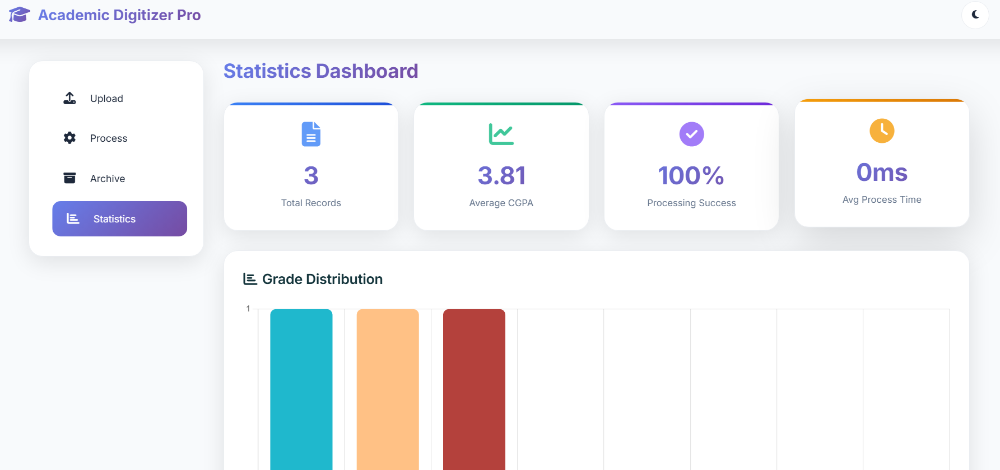
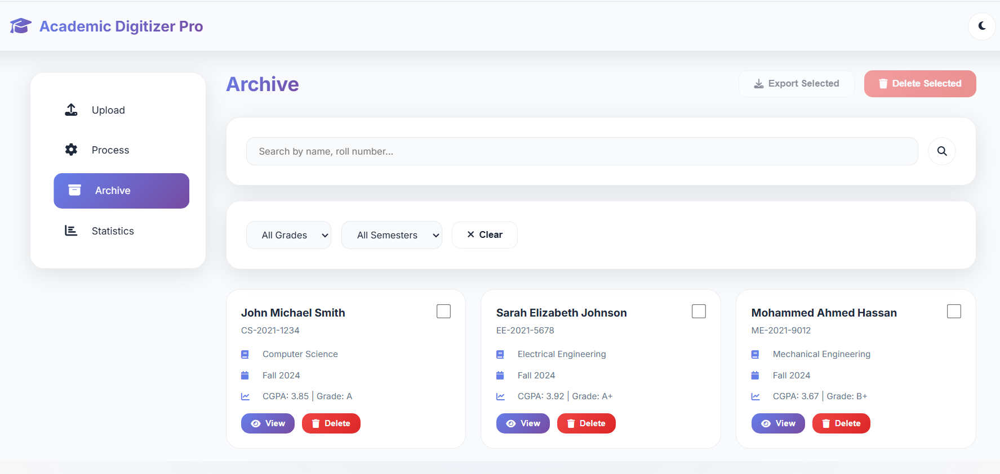

# Academic Record Digitization System

A modern, fully functional web application for digitizing legacy academic record sheets with instant OCR, smart field extraction, offline-first storage.  

---

---

## 🚀 Features

- **Instant demo mode:** Click “Try Demo” for 3 sample student records
- **Modern UI:** Glassmorphism, gradients, neumorphism, dark mode, and micro-animations
- **Drag-and-drop upload:** PDF, JPG, PNG (batch supported)
- **Real OCR extraction:** Tesseract.js (100+ languages), works offline in-browser
- **Automatic field parsing:** Names, roll nos., grades, CGPA, subject tables—pattern matched
- **Inline data validation:** Edit any field, confidence badges, and fuzzy suggestions
- **Persistent offline archive:** IndexedDB—records never leave your device
- **Instant search & filtering:** Smart fuzzy search, filters for grade, semester, CGPA
- **One-click exports:** Download single/batch records as JSON, CSV, or ZIP
- **Statistics dashboard:** Total records, grade distribution, averages, activity feed
- **Fun feedback:** Confetti celebration, toast notifications, animated progress
- **Dark mode toggle:** All UI adapts, auto-saves your theme
- **Full PWA support:** Works 100% offline after first load

---

## 🧑‍💻 Tech Stack

- **Frontend:** HTML5, CSS3, NodeJS, Express, Java, Python, FastAPI
- **Frameworks/UI:** Bootstrap 5.3 via CDN, Font Awesome 6.4 
- **OCR Engine:** Tesseract.js 5.x 
- **PDF Renderer:** PDF.js 3.11 
- **Charts:** Chart.js 4 
- **Files & ZIP:** JSZip 3
- **Database:** IndexedDB
- **Others:** JS Confetti, Service Workers

